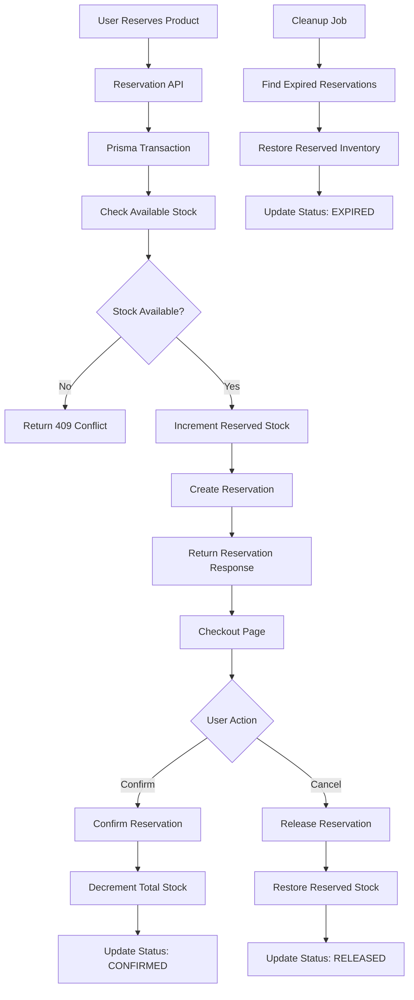

# Allo Inventory Reservation System

A production-style inventory reservation system built with **Next.js**, **Prisma**, **PostgreSQL (Neon)**, and **TypeScript** to solve real-world checkout race conditions in multi-warehouse e-commerce systems.

This application simulates how modern platforms temporarily reserve inventory during checkout to prevent overselling while still maintaining accurate stock visibility.

---

# Problem Statement

In large-scale e-commerce systems, payment confirmation can take several minutes due to:
- UPI confirmations
- 3DS authentication
- wallet redirects
- banking delays

If inventory is decremented only after payment succeeds, multiple users can successfully pay for the same physical unit.

If inventory is decremented too early (like add-to-cart), abandoned carts artificially reduce stock visibility and hurt conversions.

This system solves the problem using a **time-based inventory reservation mechanism**.

---

# Key Features

## Multi-Warehouse Inventory Management
- Products distributed across multiple warehouses
- Per-warehouse stock visibility
- Real-time available stock calculation

## Inventory Reservation Engine
- Temporary stock reservation during checkout
- Reservation expiry handling
- Reservation confirmation workflow
- Reservation release workflow

## Concurrency-Safe Checkout Logic
Implemented using **Prisma database transactions** to ensure correctness under simultaneous requests.

If two users attempt to reserve the final unit of a SKU at the same time:
- exactly one succeeds
- the other receives HTTP `409 Conflict`

This prevents overselling.

## Automatic Reservation Expiry Cleanup
Expired reservations are automatically released back into inventory using a cleanup mechanism.

The cleanup flow:
1. Detects expired PENDING reservations
2. Restores reserved inventory
3. Marks reservations as EXPIRED

## Interactive Frontend
- Product listing page
- Warehouse-wise stock visibility
- Checkout page with reservation details
- Live countdown timer
- Confirm purchase flow
- Cancel reservation flow
- Real-time UI state updates

---

# Tech Stack

## Frontend
- Next.js App Router
- React
- TypeScript
- Tailwind CSS

## Backend
- Next.js API Routes
- Prisma ORM
- PostgreSQL (Neon)

## Validation
- Zod

---

# System Architecture


# API Endpoints

## Products

### `GET /api/products`
Returns products with warehouse-wise inventory availability.

---

## Warehouses

### `GET /api/warehouses`
Returns all warehouses.

---

## Reservations

### `POST /api/reservations`
Creates a temporary reservation.

Returns:
- `200 OK` → reservation created
- `409 Conflict` → insufficient stock

---

### `POST /api/reservations/:id/confirm`
Confirms reservation after successful payment.

Behavior:
- permanently decrements stock
- updates reservation status to CONFIRMED

Returns:
- `410 Gone` if reservation expired

---

### `POST /api/reservations/:id/release`
Releases reserved stock when:
- payment fails
- user cancels checkout

Updates reservation status to RELEASED.

---

## Expiry Cleanup

### `POST /api/cleanup-expired`
Automatically:
- releases expired reservations
- restores inventory
- marks reservations as EXPIRED

Designed to work with:
- Vercel Cron Jobs
- scheduled workers
- background jobs

---

# Concurrency Handling

The reservation system is built using **database transactions** to ensure race-condition-free stock reservations.

Available stock calculation:

```txt
Available Stock = Total Stock - Reserved Stock
```

Reservation flow:
1. Fetch inventory inside transaction
2. Validate available stock
3. Increment reserved stock atomically
4. Create reservation

This guarantees consistency even under concurrent requests.

---

# Running Locally

## 1. Clone Repository

```bash
git clone <your-repository-url>
cd allo-inventory-system
```

---

## 2. Install Dependencies

```bash
npm install
```

---

## 3. Configure Environment Variables

Create a `.env` file:

```env
DATABASE_URL="YOUR_NEON_DATABASE_URL"
```

---

## 4. Push Prisma Schema

```bash
npx prisma db push
```

---

## 5. Generate Prisma Client

```bash
npx prisma generate
```

---

## 6. Seed Database

```bash
npx tsx prisma/seed.ts
```

---

## 7. Run Development Server

```bash
npm run dev
```

Application runs at:

```txt
http://localhost:3000
```

---

# Reservation Expiry Strategy

Reservations are time-bound.

If a reservation is not confirmed before `expiresAt`:
- reserved inventory is automatically restored
- reservation status becomes EXPIRED

Current implementation uses:
- cleanup API endpoint
- database-driven expiry detection

In production this can be scheduled using:
- Vercel Cron Jobs
- Background Workers
- Queue-based schedulers

---

# Trade-offs & Future Improvements

## Current Trade-offs
- Cleanup is manually triggerable via API
- No distributed locking layer
- No retry-safe idempotency implementation

## Future Improvements
- Redis-based distributed locks
- Idempotency-Key support
- WebSocket live inventory updates
- Reservation analytics dashboard
- Inventory audit logging
- Role-based admin system
- Full payment gateway integration

---
## Bonus: Idempotency Support

Implemented idempotency support for the reservation endpoint using the `Idempotency-Key` request header.

### How it works

- Clients can send a unique `Idempotency-Key` header while creating a reservation.
- The server stores the original response associated with that key in the database.
- If the same request is retried with the same key, the previously stored response is returned instead of creating a new reservation.
- This prevents duplicate reservations and duplicate stock locking during network retries or payment gateway retries.

### Example

```http
POST /api/reservations
Idempotency-Key: abc123
```

If the same request is sent again with the same key:

- no new reservation is created
- stock is not reserved again
- the original response is returned safely

### Implementation Notes

- Implemented using a dedicated `IdempotencyKey` Prisma model stored in PostgreSQL.
- Works correctly in serverless environments like Vercel.
- Prevents duplicate side effects without requiring Redis or external locking infrastructure.

---

# Deployment

## Frontend
- Vercel

## Database
- Neon PostgreSQL

---

# Why This Project Matters

This project models a real production problem faced by:
- e-commerce platforms
- ticket booking systems
- food delivery systems
- flash-sale inventory systems

The implementation focuses on:
- correctness under concurrency
- transactional integrity
- scalable reservation workflows
- clean full-stack architecture

---

# Author

**Devamithra A M**
Software Engineering Student | Full Stack Developer
